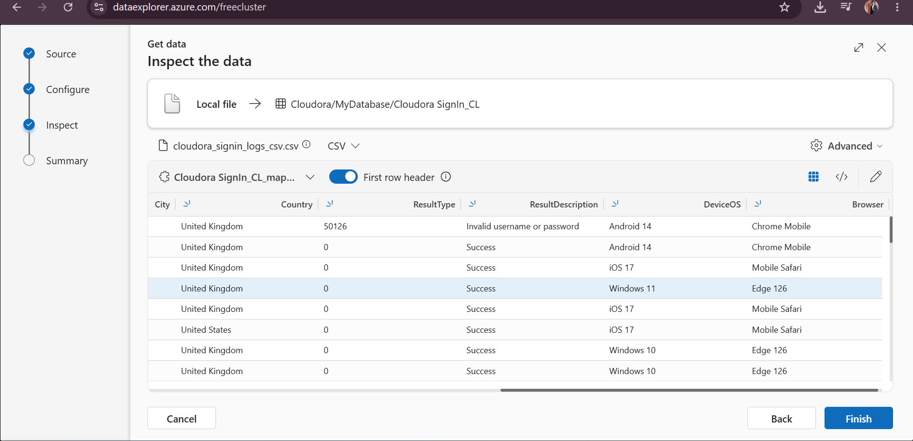
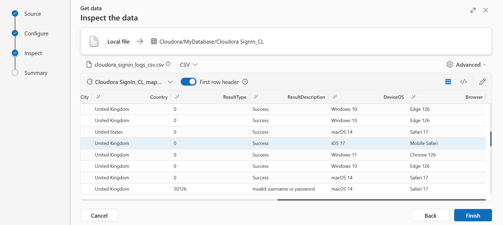
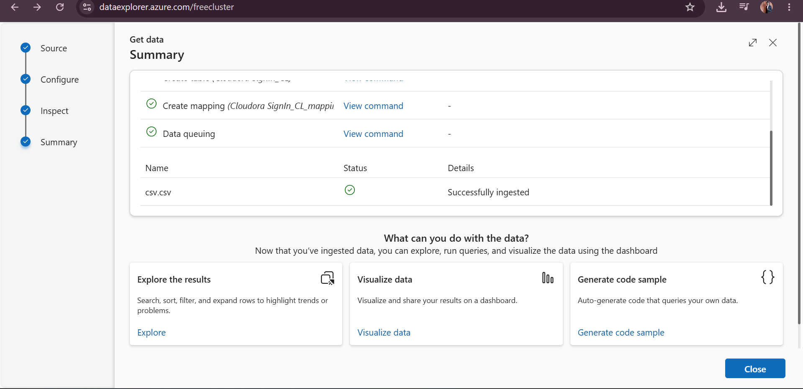
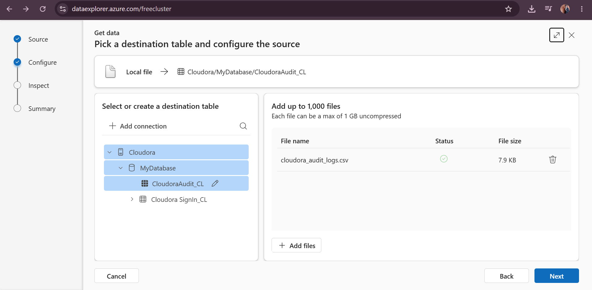
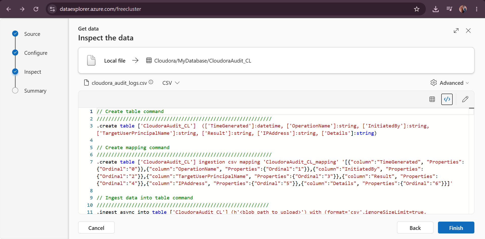

# Cloud Identity Compromise Investigation with Azure Data Explorer

Hands-on cloud security investigation using Azure Data Explorer and KQL to detect suspicious authentication, confirm account compromise, analyze post-compromise activity, and assess the scope of the incident.

## Project Overview

This project demonstrates a hands-on investigation of a simulated cloud identity compromise using Azure Data Explorer (ADX) and Kusto Query Language (KQL).

The investigation analyzes sign-in and audit logs to identify suspicious authentication activity, determine whether an account was compromised, investigate actions performed after unauthorized access, and assess the scope of the incident.

The project follows a structured SOC investigation process from detection and analysis through incident findings and recommended containment and remediation actions.

## Project Scenario

Cloudora is a simulated cloud-based organization used for this security investigation.

Suspicious authentication activity was identified within the organization's sign-in logs. The investigation was conducted to determine whether the activity represented an account compromise, identify the affected account and source of the activity, and establish what occurred after access was gained.

The investigation also examines audit activity to identify actions performed after the compromise and checks the wider environment to determine whether additional user accounts were affected.
## Investigation Objectives

The investigation was conducted to answer the following key security questions:

1. **Identify the affected account**  
   Determine which user account was associated with the suspicious authentication activity.

2. **Identify the source of the suspicious activity**  
   Analyze IP addresses, geographic locations, and authentication patterns to identify anomalous access.

3. **Determine whether unauthorized access was successful**  
   Analyze failed and successful sign-in events to determine whether the suspicious authentication attempts resulted in account compromise.

4. **Investigate post-compromise activity**  
   Correlate sign-in and audit logs to determine what actions were performed after unauthorized access was obtained.

5. **Identify persistence and account changes**  
   Investigate authentication method changes, mailbox rules, external forwarding, application consent, and group membership modifications.

6. **Assess potential data exposure**  
   Determine whether mailbox content, SharePoint files, or other sensitive organizational resources were accessed.

7. **Determine the scope of the incident**  
   Investigate whether the suspicious IP address or infrastructure successfully authenticated to any additional Cloudora user accounts.

8. **Develop response recommendations**  
   Recommend appropriate containment, remediation, and verification actions based on the investigation findings.
## Tools & Technologies Used

| Tool / Technology | Purpose |
|---|---|
| **Microsoft Azure** | Cloud platform used to host the investigation environment. |
| **Azure Data Explorer (ADX)** | Used to ingest, store, and analyze the Cloudora security logs. |
| **Kusto Query Language (KQL)** | Used to query authentication and audit telemetry, filter suspicious events, correlate activity, and reconstruct the incident timeline. |
| **Cloud Sign-In Logs** | Used to analyze authentication attempts, source IP addresses, geographic locations, applications, and authentication results. |
| **Cloud Audit Logs** | Used to investigate account changes, mailbox activity, file access, application consent, and other post-compromise actions. |
| **GitHub** | Used to document the investigation, KQL queries, evidence, findings, and response recommendations.
## Data Sources

The investigation used two synthetic datasets representing cloud authentication and audit telemetry. The datasets were ingested into Azure Data Explorer and analyzed using KQL.

### Cloudora Sign-In Logs — `CloudoraSignIn_CL`

The sign-in dataset contains authentication activity generated by Cloudora user accounts.

Key fields used during the investigation included:

- `TimeGenerated` — Timestamp of the authentication event
- `UserPrincipalName` — User account associated with the sign-in
- `AppDisplayName` — Cloud application accessed
- `IPAddress` — Source IP address
- `City` and `Country` — Geographic location of the authentication
- `ResultType` — Authentication result code
- `ResultDescription` — Description of the authentication result
- `DeviceOS` — Operating system associated with the sign-in
- `Browser` — Browser used during authentication

The dataset contains **1,479 sign-in records** and was used to establish normal authentication patterns, identify anomalous locations and IP addresses, analyze failed authentication attempts, and validate successful access.

### Cloudora Audit Logs — `CloudoraAudit_CL`

The audit dataset contains activity associated with user and cloud-resource changes.

Key fields used during the investigation included:

- `TimeGenerated` — Timestamp of the audit event
- `OperationName` — Action performed
- `InitiatedBy` — Identity that initiated the activity
- `TargetUserPrincipalName` — User account affected by the action
- `IPAddress` — Source IP associated with the activity
- `Details` — Description of the action performed

The audit logs were used to correlate activity occurring after suspicious authentication and investigate account modifications, mailbox activity, file access, application consent, and other potential post-compromise actions.

> **Lab Note:** The Cloudora datasets used in this project are synthetic and were created for hands-on security investigation and KQL practice. No production user accounts or organizational data are included.

## Investigation Methodology

The investigation followed a structured SOC incident investigation process to move from initial detection to confirmation and scope assessment.

1. **Data Ingestion and Validation**  
   Imported the Cloudora sign-in and audit datasets into Azure Data Explorer and verified that the logs were available for analysis.

2. **Authentication Baseline Analysis**  
   Analyzed user sign-in activity, IP addresses, geographic locations, and authentication results to understand normal and abnormal behavior.

3. **Suspicious Activity Identification**  
   Investigated anomalous authentication activity and identified the source IP associated with the suspicious sign-in attempts.

4. **Authentication Timeline Analysis**  
   Reconstructed the sequence of failed and successful authentication events to determine whether unauthorized access was achieved.

5. **Audit Log Correlation**  
   Pivoted from sign-in telemetry to audit logs using the suspicious source IP to investigate activity occurring after authentication.

6. **Post-Compromise Analysis**  
   Reviewed authentication changes, mailbox modifications, email access, file access, application consent, and group membership activity.

7. **Scope Assessment**  
   Searched the wider sign-in dataset to determine whether the suspicious infrastructure successfully authenticated to additional Cloudora accounts.

8. **Incident Response Recommendations**  
   Developed containment, remediation, and verification recommendations based on the investigation findings.
   
---

## Investigation & Findings

### 1. Sign-In Log Data Ingestion

The investigation began by importing the synthetic Cloudora sign-in logs into Azure Data Explorer. The CSV dataset was configured for ingestion into the `CloudoraSignIn_CL` table within the investigation database.

This provided the authentication telemetry required for subsequent analysis of user accounts, source IP addresses, geographic locations, applications, and authentication results.!
**Figure 01 — Cloudora Sign-In Log Data Ingestion**

The screenshot shows the sign-in CSV being configured for ingestion into Azure Data Explorer and mapped to the `CloudoraSignIn_CL` table.
### 2. Sign-In Data Inspection

After configuring the sign-in log ingestion, the dataset was previewed to verify that the CSV records were parsed correctly before completing the ingestion process.

The inspection confirmed that important authentication attributes such as geographic location, authentication result, operating system, and browser information were present and available for analysis.

**Figure 02 — Sign-In Data Inspection**

The data preview was used to validate the structure and quality of the sign-in telemetry before proceeding with the investigation.### 3. Sign-In Schema Validation

The sign-in log schema was reviewed to ensure that each CSV field was mapped to the appropriate column and data type in Azure Data Explorer.

This validation was important because accurate field mapping ensures that KQL queries can correctly analyze timestamps, user identities, IP addresses, geographic locations, authentication results, devices, and applications.

**Figure 03 — Sign-In Schema Validation**

The schema review confirmed that the sign-in fields were correctly structured and mapped, preparing the `CloudoraSignIn_CL` table for reliable KQL analysis.### 4. Sign-In Log Ingestion Validation

After validating the schema and field mappings, the ingestion process was completed in Azure Data Explorer.

Azure Data Explorer confirmed that the sign-in dataset was successfully ingested into the `CloudoraSignIn_CL` table. This ensured that the authentication telemetry was available for querying and further investigation using KQL.

**Figure 04 — Sign-In Log Ingestion Success**

The successful ingestion status confirmed that the sign-in dataset had been loaded into Azure Data Explorer and was ready for security analysis.### 5. Audit Log Data Ingestion

After successfully ingesting the sign-in telemetry, the Cloudora audit logs were imported into Azure Data Explorer to support investigation of activities performed within the cloud environment.

The audit dataset provides visibility into security-relevant actions such as authentication method changes, mailbox modifications, file access, application consent, and group membership changes.

**Figure 05 — Cloudora Audit Log Data Ingestion**

The screenshot shows the audit CSV dataset being configured for ingestion into the `CloudoraAudit_CL` table. This dataset would later be correlated with suspicious authentication activity to reconstruct actions performed after account compromise.### 6. Audit Log Schema Mapping

The audit log schema was reviewed to ensure that the CSV fields were correctly mapped to the appropriate columns and data types in Azure Data Explorer.

Key fields such as `TimeGenerated`, `OperationName`, `InitiatedBy`, `TargetUserPrincipalName`, `IPAddress`, and `Details` were validated to ensure that security events could be accurately queried and correlated during the investigation.

**Figure 06 — Audit Log Schema Mapping**

The schema mapping confirmed that the audit telemetry was correctly structured for KQL analysis. This provided the fields required to correlate suspicious source IP addresses with account changes, mailbox activity, file access, application consent, and other post-compromise actions.

