# Cloud Identity Compromise Investigation with Azure Data Explorer

Hands-on cloud security investigation using Azure Data Explorer and KQL to detect suspicious authentication, confirm account compromise, analyze post-compromise activity, and assess the scope of the incident.

## Project Overview

This project demonstrates a hands-on investigation of a simulated cloud identity compromise using Azure Data Explorer (ADX) and Kusto Query Language (KQL).

The investigation analyzes sign-in and audit logs to identify suspicious authentication activity, determine whether an account was compromised, investigate actions performed after unauthorized access, and assess the scope of the incident.

The project follows a structured SOC investigation process from detection and analysis through incident findings and recommended containment and remediation actions.

## Project Scenario

Cloudora is a simulated cloud-based organization used for this security investigation.

Suspicious authentication activity was identified within the organization's sign-in logs. The investigation was conducted to determine whether the activity represented an account compromise, identify the affected account and source of the activity, and establish what occurred after access was gained.

The investigation also examines audit activity to identify actions performed after the compromise and checks the wider environment to determine whether additional user accounts were affected.
## Investigation Objectives

The investigation was conducted to answer the following key security questions:

1. **Identify the affected account**  
   Determine which user account was associated with the suspicious authentication activity.

2. **Identify the source of the suspicious activity**  
   Analyze IP addresses, geographic locations, and authentication patterns to identify anomalous access.

3. **Determine whether unauthorized access was successful**  
   Analyze failed and successful sign-in events to determine whether the suspicious authentication attempts resulted in account compromise.

4. **Investigate post-compromise activity**  
   Correlate sign-in and audit logs to determine what actions were performed after unauthorized access was obtained.

5. **Identify persistence and account changes**  
   Investigate authentication method changes, mailbox rules, external forwarding, application consent, and group membership modifications.

6. **Assess potential data exposure**  
   Determine whether mailbox content, SharePoint files, or other sensitive organizational resources were accessed.

7. **Determine the scope of the incident**  
   Investigate whether the suspicious IP address or infrastructure successfully authenticated to any additional Cloudora user accounts.

8. **Develop response recommendations**  
   Recommend appropriate containment, remediation, and verification actions based on the investigation findings.
## Tools & Technologies Used

| Tool / Technology | Purpose |
|---|---|
| **Microsoft Azure** | Cloud platform used to host the investigation environment. |
| **Azure Data Explorer (ADX)** | Used to ingest, store, and analyze the Cloudora security logs. |
| **Kusto Query Language (KQL)** | Used to query authentication and audit telemetry, filter suspicious events, correlate activity, and reconstruct the incident timeline. |
| **Cloud Sign-In Logs** | Used to analyze authentication attempts, source IP addresses, geographic locations, applications, and authentication results. |
| **Cloud Audit Logs** | Used to investigate account changes, mailbox activity, file access, application consent, and other post-compromise actions. |
| **GitHub** | Used to document the investigation, KQL queries, evidence, findings, and response recommendations.
## Data Sources

The investigation used two synthetic datasets representing cloud authentication and audit telemetry. The datasets were ingested into Azure Data Explorer and analyzed using KQL.

### Cloudora Sign-In Logs — `CloudoraSignIn_CL`

The sign-in dataset contains authentication activity generated by Cloudora user accounts.

Key fields used during the investigation included:

- `TimeGenerated` — Timestamp of the authentication event
- `UserPrincipalName` — User account associated with the sign-in
- `AppDisplayName` — Cloud application accessed
- `IPAddress` — Source IP address
- `City` and `Country` — Geographic location of the authentication
- `ResultType` — Authentication result code
- `ResultDescription` — Description of the authentication result
- `DeviceOS` — Operating system associated with the sign-in
- `Browser` — Browser used during authentication

The dataset contains **1,479 sign-in records** and was used to establish normal authentication patterns, identify anomalous locations and IP addresses, analyze failed authentication attempts, and validate successful access.

### Cloudora Audit Logs — `CloudoraAudit_CL`

The audit dataset contains activity associated with user and cloud-resource changes.

Key fields used during the investigation included:

- `TimeGenerated` — Timestamp of the audit event
- `OperationName` — Action performed
- `InitiatedBy` — Identity that initiated the activity
- `TargetUserPrincipalName` — User account affected by the action
- `IPAddress` — Source IP associated with the activity
- `Details` — Description of the action performed

The audit logs were used to correlate activity occurring after suspicious authentication and investigate account modifications, mailbox activity, file access, application consent, and other potential post-compromise actions.

> **Lab Note:** The Cloudora datasets used in this project are synthetic and were created for hands-on security investigation and KQL practice. No production user accounts or organizational data are included.

## Investigation Methodology

The investigation followed a structured SOC incident investigation process to move from initial detection to confirmation and scope assessment.

1. **Data Ingestion and Validation**  
   Imported the Cloudora sign-in and audit datasets into Azure Data Explorer and verified that the logs were available for analysis.

2. **Authentication Baseline Analysis**  
   Analyzed user sign-in activity, IP addresses, geographic locations, and authentication results to understand normal and abnormal behavior.

3. **Suspicious Activity Identification**  
   Investigated anomalous authentication activity and identified the source IP associated with the suspicious sign-in attempts.

4. **Authentication Timeline Analysis**  
   Reconstructed the sequence of failed and successful authentication events to determine whether unauthorized access was achieved.

5. **Audit Log Correlation**  
   Pivoted from sign-in telemetry to audit logs using the suspicious source IP to investigate activity occurring after authentication.

6. **Post-Compromise Analysis**  
   Reviewed authentication changes, mailbox modifications, email access, file access, application consent, and group membership activity.

7. **Scope Assessment**  
   Searched the wider sign-in dataset to determine whether the suspicious infrastructure successfully authenticated to additional Cloudora accounts.

8. **Incident Response Recommendations**  
   Developed containment, remediation, and verification recommendations based on the investigation findings.
   
---

## Investigation & Findings

### 1. Sign-In Log Data Ingestion

The investigation began by importing the synthetic Cloudora sign-in logs into Azure Data Explorer. The CSV dataset was configured for ingestion into the `CloudoraSignIn_CL` table within the investigation database.

This provided the authentication telemetry required for subsequent analysis of user accounts, source IP addresses, geographic locations, applications, and authentication results.!
**Figure 01 — Cloudora Sign-In Log Data Ingestion**

The screenshot shows the sign-in CSV being configured for ingestion into Azure Data Explorer and mapped to the `CloudoraSignIn_CL` table.
### 2. Sign-In Data Inspection

After configuring the sign-in log ingestion, the dataset was previewed to verify that the CSV records were parsed correctly before completing the ingestion process.

The inspection confirmed that important authentication attributes such as geographic location, authentication result, operating system, and browser information were present and available for analysis.


**Figure 02 — Sign-In Data Inspection**

The data preview was used to validate the structure and quality of the sign-in telemetry before proceeding with the investigation.
### 3. Sign-In Schema Validation

The sign-in log schema was reviewed to ensure that each CSV field was mapped to the appropriate column and data type in Azure Data Explorer.

This validation was important because accurate field mapping ensures that KQL queries can correctly analyze timestamps, user identities, IP addresses, geographic locations, authentication results, devices, and applications.


**Figure 03 — Sign-In Schema Validation**

The schema review confirmed that the sign-in fields were correctly structured and mapped, preparing the `CloudoraSignIn_CL` table for reliable KQL analysis.
### 4. Sign-In Log Ingestion Validation

After validating the schema and field mappings, the ingestion process was completed in Azure Data Explorer.

Azure Data Explorer confirmed that the sign-in dataset was successfully ingested into the `CloudoraSignIn_CL` table. This ensured that the authentication telemetry was available for querying and further investigation using KQL.


**Figure 04 — Sign-In Log Ingestion Success**

The successful ingestion status confirmed that the sign-in dataset had been loaded into Azure Data Explorer and was ready for security analysis.
### 5. Audit Log Data Ingestion

After successfully ingesting the sign-in telemetry, the Cloudora audit logs were imported into Azure Data Explorer to support investigation of activities performed within the cloud environment.

The audit dataset provides visibility into security-relevant actions such as authentication method changes, mailbox modifications, file access, application consent, and group membership changes.


**Figure 05 — Cloudora Audit Log Data Ingestion**

The screenshot shows the audit CSV dataset being configured for ingestion into the `CloudoraAudit_CL` table. This dataset would later be correlated with suspicious authentication activity to reconstruct actions performed after account compromise.
### 6. Audit Log Schema Mapping

The audit log schema was reviewed to ensure that the CSV fields were correctly mapped to the appropriate columns and data types in Azure Data Explorer.

Key fields such as `TimeGenerated`, `OperationName`, `InitiatedBy`, `TargetUserPrincipalName`, `IPAddress`, and `Details` were validated to ensure that security events could be accurately queried and correlated during the investigation.


**Figure 06 — Audit Log Schema Mapping**

The schema mapping confirmed that the audit telemetry was correctly structured for KQL analysis. This provided the fields required to correlate suspicious source IP addresses with account changes, mailbox activity, file access, application consent, and other post-compromise actions.
### 7. Audit Log Ingestion Validation

After validating the audit log schema and field mappings, the ingestion process was completed in Azure Data Explorer.

Azure Data Explorer confirmed that the audit dataset was successfully ingested into the `CloudoraAudit_CL` table. The environment now contained both authentication and audit telemetry required for the investigation.

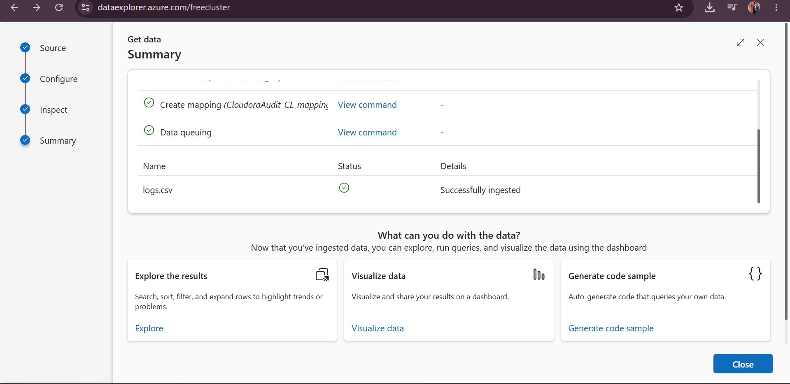

**Figure 07 — Audit Log Ingestion Success**

The successful ingestion confirmed that the audit telemetry was available for KQL analysis and could be correlated with the sign-in logs during the investigation.
### 8. Sign-In Dataset Validation

Before beginning the security investigation, the sign-in dataset was queried to confirm that the records had been successfully ingested and were available for analysis.

The following KQL query was executed:

```kusto
CloudoraSignIn_CL
| count
```
### 9. Initial User Sign-In Investigation

After validating the dataset, the investigation moved to user authentication activity. Sign-in events associated with `daniel.reeve@cloudora.io` were reviewed to identify unusual authentication behavior.

The following KQL query was used to retrieve Daniel Reeve's authentication history:

```kusto
CloudoraSignIn_CL
| where UserPrincipalName == "daniel.reeve@cloudora.io"
| project TimeGenerated, AppDisplayName, IPAddress, City, Country, ResultType, ResultDescription
| order by TimeGenerated asc
```

The results provided a chronological view of the account's authentication activity, including source IP addresses, geographic locations, applications accessed, and authentication outcomes.

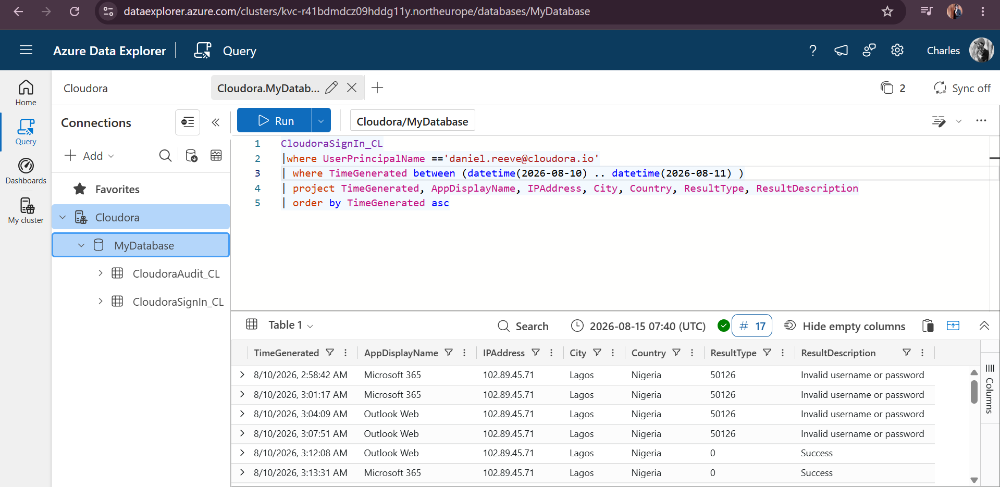

**Figure 09 — Initial Sign-In Investigation**

Reviewing the account's sign-in history revealed authentication activity from multiple locations and IP addresses. This required further analysis to distinguish expected user activity from potentially unauthorized access.
### 10. IP Address and Geographic Location Analysis

To better understand the account's authentication behavior, Daniel Reeve's sign-in activity was grouped by source IP address and geographic location.

The following KQL query was used:

```kusto
CloudoraSignIn_CL
| where UserPrincipalName contains "daniel"
| summarize SignIn=count(), FirstSeen=min(TimeGenerated), LastSeen=max(TimeGenerated) by City, Country, IPAddress
| order by SignIn desc
```

This provided a baseline of the locations and IP addresses associated with the account and made it easier to identify activity that required further investigation.

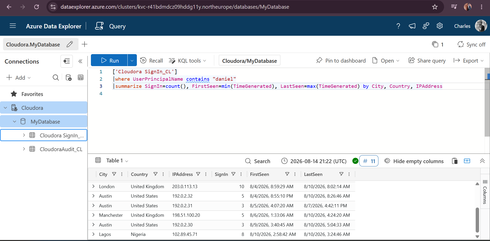

**Figure 10 — User IP Address and Geographic Location Analysis**

The results showed sign-in activity associated with multiple locations, including London, Austin, Manchester, and Lagos. The Lagos activity originated from `102.89.45.71` and appeared less frequently than the account's established sign-in locations.

At this stage, the geographic difference alone was not treated as proof of compromise. Instead, the source IP was identified for further authentication analysis to determine whether its behavior was consistent with unauthorized access.### 11. Failed Authentication Analysis

The investigation was expanded beyond a single user to identify IP addresses generating failed authentication attempts across the Cloudora environment.

The following KQL query was used to summarize failed authentication activity:

```kusto
CloudoraSignIn_CL
| where ResultType == "50126"
| summarize Failures=count(), TargetedAccount=dcount(UserPrincipalName) by IPAddress, City, Country
| order by Failures asc
```

This query grouped invalid username or password events by source IP address and geographic location while also counting the number of distinct accounts associated with each source.

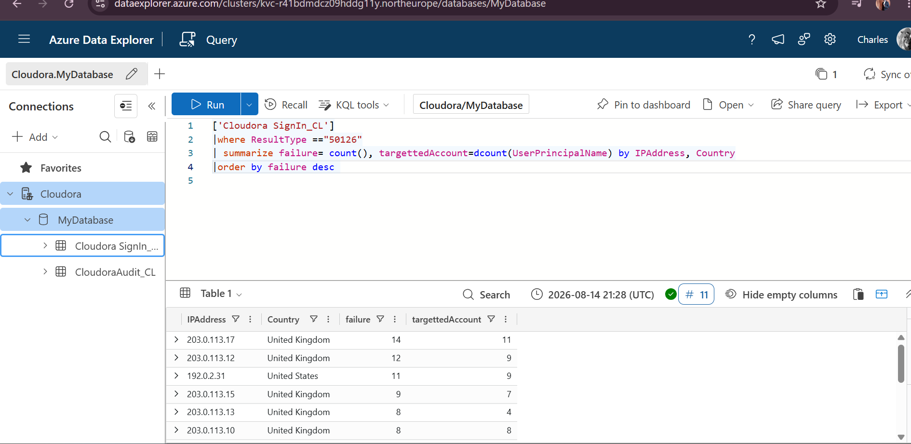


**Figure 11 — Failed Authentication Analysis**

The results showed failed authentication events originating from several IP addresses. Because authentication failures alone do not prove malicious activity, additional analysis was required to determine whether any source demonstrated a failure-to-success pattern indicative of possible account compromise.


### 12. Suspicious IP Authentication Timeline

After identifying `102.89.45.71` as an IP requiring further investigation, its authentication activity was examined chronologically.

The following KQL query was used:

```kusto
CloudoraSignIn_CL
| where IPAddress == "102.89.45.71"
| project TimeGenerated, UserPrincipalName, AppDisplayName, IPAddress, City, Country, ResultType, ResultDescription
| order by TimeGenerated asc
```

The chronological results revealed repeated failed authentication attempts followed by successful authentication events involving `daniel.reeve@cloudora.io`.

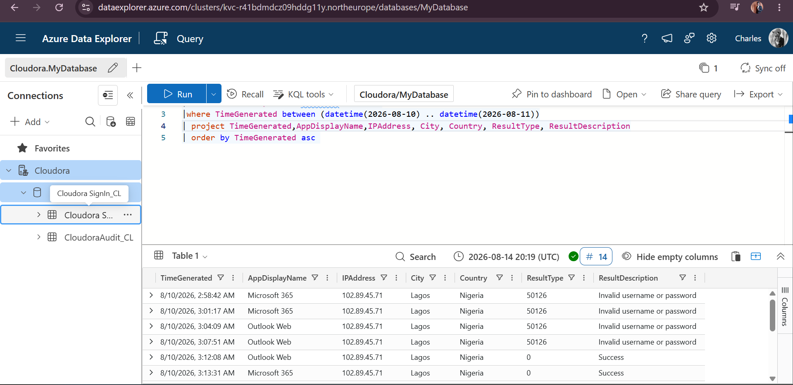

**Figure 12 — Suspicious IP Authentication Timeline**

The source IP generated multiple `50126` authentication failures before later producing successful `ResultType == 0` events. This failure-to-success transition significantly increased the likelihood that the activity represented unauthorized access and warranted deeper investigation.


### 13. User Sign-In Location Baseline

To place the suspicious activity in context, the account's authentication history was summarized by location and IP address.

```kusto
CloudoraSignIn_CL
| where UserPrincipalName contains "daniel"
| summarize SignIn=count(), FirstSeen=min(TimeGenerated), LastSeen=max(TimeGenerated) by City, Country, IPAddress
| order by SignIn desc
```

This allowed the suspicious Lagos authentication activity to be compared with the account's other observed sign-in locations.

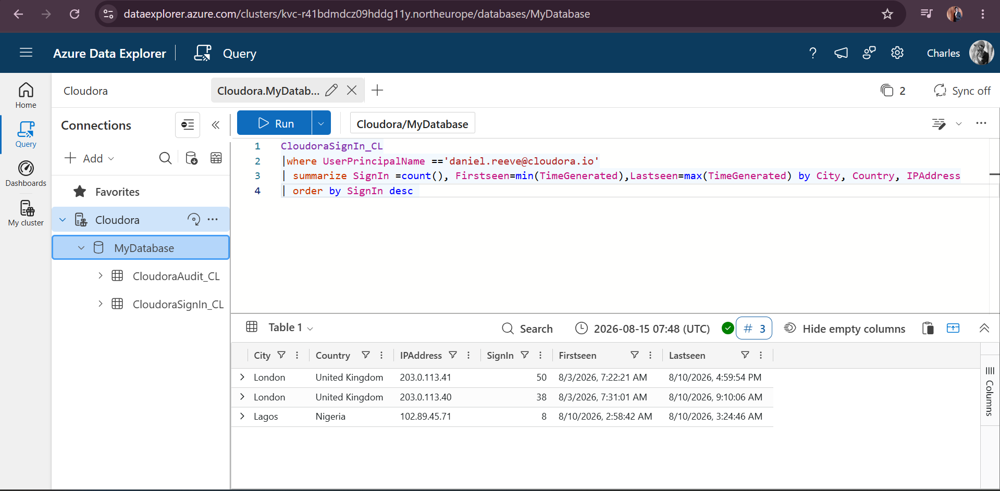

**Figure 13 — User Sign-In Location Baseline**

The account showed authentication activity from London, Austin, Manchester, and Lagos. The Lagos activity from `102.89.45.71` was treated as an anomaly requiring investigation rather than as proof of compromise based solely on geographic location.


### 14. Suspicious IP Sign-In Investigation

The investigation then focused specifically on authentication events originating from `102.89.45.71` to determine the sequence and outcome of the sign-in attempts.

```kusto
CloudoraSignIn_CL
| where IPAddress == "102.89.45.71"
| project TimeGenerated, UserPrincipalName, AppDisplayName, IPAddress, City, Country, ResultType, ResultDescription
| order by TimeGenerated asc
```

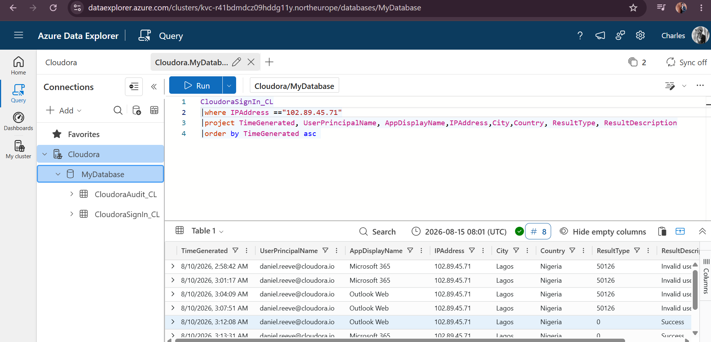

**Figure 14 — Suspicious IP Sign-In Investigation**

The timeline showed four failed authentication attempts followed by successful authentications for Daniel Reeve's account. The successful access following repeated credential failures provided stronger evidence of account compromise than geographic anomaly alone.


### 15. Failed Sign-In Source Analysis

To determine whether the suspicious behavior was part of a wider authentication pattern, failed credential events were compared across source IP addresses.

```kusto
CloudoraSignIn_CL
| where ResultType == "50126"
| summarize Failures=count(), TargetedAccount=dcount(UserPrincipalName) by IPAddress, City, Country
| order by Failures asc
```

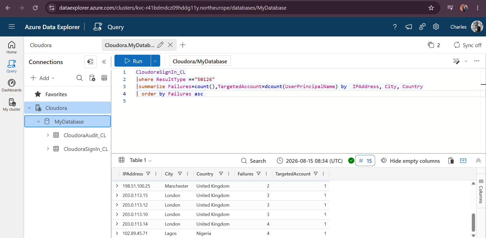

**Figure 15 — Failed Sign-In Source Analysis**

The analysis showed that `102.89.45.71` generated four failed authentication events against one observed account. Other IP addresses also generated authentication failures, demonstrating why failed logins alone were insufficient to classify the activity as an attack.

The key differentiator was that the suspicious Lagos source was subsequently associated with successful authentication and security-sensitive audit activity.


### 16. Failure-to-Success Authentication Pattern

The suspicious IP range was summarized by authentication result and time to quantify the transition from unsuccessful attempts to successful access.

```kusto
CloudoraSignIn_CL
| where IPAddress startswith "102.89."
| summarize Attempt=count() by bin(TimeGenerated, 1d), ResultType
```

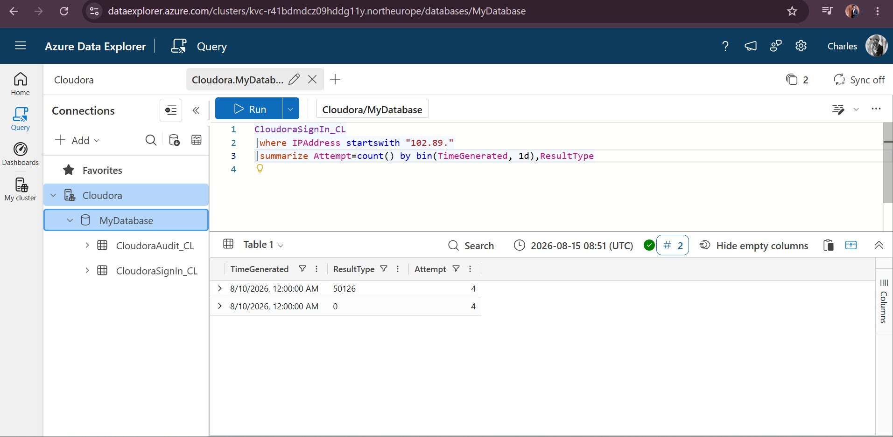

**Figure 16 — Suspicious IP Failure-to-Success Pattern**

The results identified four failed authentication events (`50126`) and four successful authentication events (`0`) associated with the suspicious source range.

Combined with the chronological sign-in evidence, this demonstrated a failure-to-success authentication pattern requiring further investigation. The investigation therefore pivoted to the audit logs to determine what occurred after successful authentication.


### 17. Post-Compromise Audit Investigation

After identifying successful authentication from the suspicious infrastructure, the investigation pivoted from sign-in telemetry to the `CloudoraAudit_CL` dataset.

The suspicious IP range was used as the correlation point:

```kusto
CloudoraAudit_CL
| where IPAddress startswith "102.89."
| project TimeGenerated, OperationName, InitiatedBy, TargetUserPrincipalName, IPAddress, Details
| order by TimeGenerated asc
```

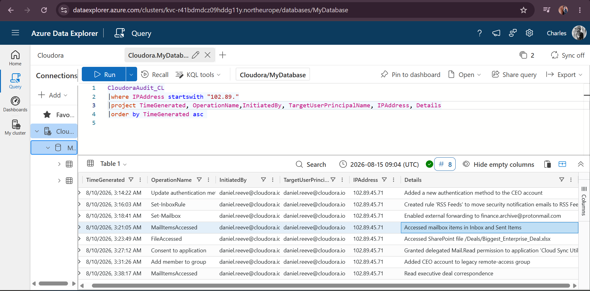

**Figure 17 — Post-Compromise Audit Timeline**

Audit correlation identified a sequence of security-sensitive actions after successful authentication, including:

- Addition of a new authentication method to the affected account.
- Creation of an inbox rule designed to move security notification emails.
- Configuration of external email forwarding.
- Access to Inbox and Sent Items.
- Access to the SharePoint file `/Deals/Biggest_Enterprise_Deal.xlsx`.
- Delegated `Mail.Read` consent granted to the application `Cloud Sync Utility`.
- Addition of the affected account to a legacy remote-access group.
- Access to executive deal correspondence.

The correlation between the suspicious authentication source and these subsequent audit events provided strong evidence that the account had been compromised and used for unauthorized post-authentication activity.


### 18. Compromise Scope Validation

After confirming compromise of the affected account, the investigation assessed whether the suspicious IP range had successfully authenticated to additional Cloudora identities.

The following KQL query searched all successful sign-ins originating from the suspicious range:

```kusto
CloudoraSignIn_CL
| where IPAddress startswith "102.89." and ResultType == "0"
| summarize by UserPrincipalName, IPAddress, TimeGenerated
| order by TimeGenerated asc
```

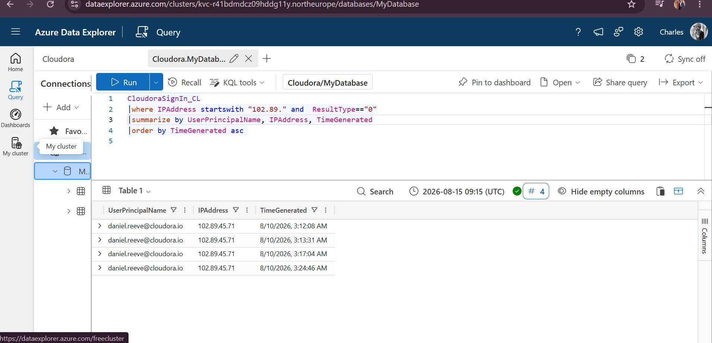


**Figure 18 — Compromise Scope Validation**

Within the available sign-in telemetry, successful authentication from the investigated `102.89.*` range was associated with `daniel.reeve@cloudora.io`.

No additional successfully authenticated Cloudora identities from this suspicious IP range were identified in the analyzed dataset.

This helped establish the observed scope of the incident while avoiding the assumption that the absence of additional successful sign-ins from this IP range proves that no other compromise occurred through different infrastructure.---

## Key Investigation Findings

The investigation identified evidence consistent with a successful compromise of the Cloudora account `daniel.reeve@cloudora.io`.

### Confirmed Findings

- **Affected account:** `daniel.reeve@cloudora.io`
- **Suspicious source IP:** `102.89.45.71`
- **Observed location:** Lagos, Nigeria
- **Authentication pattern:** Multiple failed authentication attempts followed by successful sign-ins.
- **Successful unauthorized access:** Successful authentication events were observed after the failed attempts.
- **Authentication modification:** A new authentication method was added to the affected account.
- **Defense evasion:** An inbox rule was created to move security notification emails.
- **Mailbox modification:** External email forwarding was configured.
- **Mailbox access:** Inbox, Sent Items, and executive correspondence were accessed.
- **Sensitive file access:** `/Deals/Biggest_Enterprise_Deal.xlsx` was accessed.
- **Application consent:** `Mail.Read` permission was granted to `Cloud Sync Utility`.
- **Persistence / access modification:** The affected account was added to a legacy remote-access group.
- **Observed incident scope:** No additional successful Cloudora account authentications from the investigated `102.89.*` range were identified within the available sign-in telemetry.

### Incident Assessment

The combination of repeated authentication failures, subsequent successful authentication, and security-sensitive audit activity originating from the same suspicious infrastructure provides strong evidence of an account compromise.

The activity did not end with account access. The post-authentication actions indicate attempts to maintain access, manipulate email behavior, access potentially sensitive information, and modify account or application permissions.

Based on the available telemetry, the incident should therefore be treated as a **confirmed cloud identity compromise requiring immediate containment and remediation**.
---

## Incident Timeline

Correlation of the sign-in and audit telemetry produced the following chronological sequence of events on **10 August 2026**.

| Time | Event | Investigation Significance |
|---|---|---|
| **02:58** | Failed authentication from `102.89.45.71` | First observed failed attempt from the suspicious source. |
| **03:01** | Failed authentication | Repeated credential failure against the affected account. |
| **03:04** | Failed authentication | Continued unsuccessful authentication activity. |
| **03:07** | Failed authentication | Fourth observed failed authentication attempt. |
| **03:12:08** | **Successful authentication** | First observed successful authentication from the suspicious IP following repeated failures. |
| **03:13:31** | **Successful authentication** | Additional successful access from the same suspicious source. |
| **03:14:22** | Authentication method updated | A new authentication method was added to the affected account. |
| **03:16:03** | Inbox rule created | Rule named `RSS Feeds` was created to move security notification emails. |
| **03:17:04** | Successful authentication | Further successful access from the suspicious source. |
| **03:18:41** | External forwarding enabled | Mail forwarding was configured to `finance.archive@protonmail.com`. |
| **03:21:05** | Mailbox items accessed | Inbox and Sent Items were accessed. |
| **03:23:49** | SharePoint file accessed | `/Deals/Biggest_Enterprise_Deal.xlsx` was accessed. |
| **03:24:46** | Successful authentication | Additional successful authentication from the suspicious source. |
| **03:27:12** | Application consent granted | `Mail.Read` delegated permission was granted to `Cloud Sync Utility`. |
| **03:31:26** | Group membership modified | The affected account was added to a legacy remote-access group. |
| **03:38:17** | Executive correspondence accessed | Executive deal-related email correspondence was accessed. |

### Timeline Analysis

The timeline shows a progression from repeated authentication failures to successful account access and subsequent security-sensitive activity.

The close temporal relationship between successful authentication from `102.89.45.71` and the subsequent audit events strengthens the assessment that the successful authentication represented unauthorized access rather than an isolated geographic anomaly.

The post-authentication activity also indicates that the incident extended beyond initial account access to include account modification, mailbox manipulation, potential persistence mechanisms, application permission changes, and access to potentially sensitive business information.
---

## Containment, Remediation & Verification

Following confirmation of the account compromise, the investigation moved into the incident-response phase.

Azure Data Explorer was used to identify the affected identity, suspicious infrastructure, authentication timeline, post-compromise activity, and observed scope of the incident. Because the lab environment was designed primarily for log investigation, the following containment and remediation actions represent the recommended response that should be performed through the appropriate identity, messaging, application, and security administration tools.

### Containment

Immediate containment should focus on preventing continued attacker access while preserving relevant evidence.

Recommended actions include:

- **Disable or temporarily block the compromised account** `daniel.reeve@cloudora.io`.
- **Revoke active sessions and refresh tokens** associated with the affected identity.
- **Reset the account password** using a secure administrative process.
- **Block the suspicious IP address** `102.89.45.71` where technically and operationally appropriate.
- **Remove the unauthorized authentication method** added after the suspicious login.
- **Remove the affected account from the legacy remote-access group** if the membership change was unauthorized.
- **Disable external mailbox forwarding** configured during the incident.
- **Remove the suspicious inbox rule** created to redirect security notifications.
- **Revoke application consent** granted to `Cloud Sync Utility` and investigate the application before allowing further access.
- Preserve relevant sign-in and audit telemetry for further investigation.

### Remediation

After immediate containment, remediation should address the changes introduced during the compromise and reduce the likelihood of recurrence.

Recommended actions include:

1. Review all authentication methods registered to the affected identity and retain only verified methods.
2. Require strong MFA for the affected account and other high-value identities.
3. Review Conditional Access policies for risky, anomalous, and geographically unusual authentication.
4. Review mailbox forwarding rules and inbox rules for unauthorized modifications.
5. Review OAuth and delegated application permissions for suspicious or unnecessary consent grants.
6. Review privileged and remote-access group memberships.
7. Investigate access to `/Deals/Biggest_Enterprise_Deal.xlsx` and determine the sensitivity and potential exposure of the information.
8. Review mailbox activity to determine what messages or attachments may have been accessed.
9. Search for indicators associated with the suspicious infrastructure across additional available security telemetry.
10. Strengthen monitoring and alerting for authentication failures followed by successful access.

### Verification

After containment and remediation, verification should confirm that attacker access and persistence mechanisms have been removed.

The security team should verify that:

- The unauthorized authentication method no longer exists.
- Existing attacker sessions and tokens have been revoked.
- The compromised password has been replaced.
- The malicious inbox rule has been removed.
- External forwarding is disabled.
- Suspicious application consent has been revoked.
- Unauthorized group membership has been removed.
- No additional successful authentication from the investigated suspicious infrastructure is occurring.
- No further suspicious mailbox or file-access activity is observed.
- The affected identity has returned to an expected authentication pattern.

### Response Outcome

The investigation provided sufficient evidence to identify the affected identity, reconstruct the authentication sequence, correlate post-compromise activity, and assess the observed scope of the incident.

The recommended response follows the incident lifecycle from **containment → remediation → verification**, ensuring that immediate attacker access is addressed while also removing persistence mechanisms and validating that the environment has returned to an expected security state.

> **Lab Limitation:** Containment and remediation actions were documented as recommended response procedures rather than executed against a production identity environment. Azure Data Explorer was used for log ingestion, querying, correlation, investigation, and validation of the available telemetry.---

## MITRE ATT&CK Mapping

The observed activity was mapped to relevant MITRE ATT&CK techniques to demonstrate how the investigation findings relate to recognized adversary behaviors.

| Observed Activity | MITRE ATT&CK Technique | Technique ID | Evidence |
|---|---|---|---|
| Repeated authentication failures followed by successful access | Brute Force: Password Guessing | T1110.001 | Multiple failed authentication attempts from `102.89.45.71` were followed by successful authentication to the affected account. |
| Addition of a new authentication method | Account Manipulation: Additional Cloud Roles / Credentials | T1098 | A new authentication method was added after suspicious authentication. |
| Creation of an inbox rule to redirect security notifications | Email Collection / Mailbox Manipulation | T1114 | An inbox rule named `RSS Feeds` was created to move security notification emails. |
| External mailbox forwarding | Email Forwarding Rule | T1114.003 | External forwarding was configured to `finance.archive@protonmail.com`. |
| Inbox and Sent Items accessed | Email Collection: Remote Email Collection | T1114.002 | Mailbox items were accessed following successful authentication. |
| SharePoint document accessed | Data from Information Repositories | T1213 | `/Deals/Biggest_Enterprise_Deal.xlsx` was accessed. |
| `Mail.Read` permission granted to an application | Account Access / Application Consent Abuse | T1098 | Delegated mailbox access was granted to `Cloud Sync Utility`. |
| Account added to legacy remote-access group | Account Manipulation | T1098 | The affected identity was added to a remote-access group following compromise. |

### ATT&CK Analysis

The mapped techniques show that the observed activity progressed beyond initial unauthorized authentication.

The attacker behavior represented in the synthetic telemetry included credential-based access, account modification, mailbox manipulation, application permission changes, access to organizational information, and mechanisms that could support continued access.

Mapping the investigation to MITRE ATT&CK provides a standardized way to describe the observed adversary behavior and helps connect technical findings with detection engineering and incident-response activities.

---

## Lessons Learned

This investigation demonstrated the importance of correlating multiple telemetry sources when investigating identity-based security incidents.

Key lessons from the investigation include:

- A geographic anomaly alone is not sufficient evidence of compromise.
- Authentication failures should be analyzed together with subsequent successful authentication.
- Successful authentication does not represent the end of an identity investigation; post-authentication activity must also be examined.
- Audit logs can reveal persistence mechanisms, account modifications, mailbox manipulation, application consent, and sensitive resource access.
- IP addresses can provide useful correlation points between authentication and audit telemetry.
- Scope validation is necessary before concluding that an incident affected only one identity.
- KQL provides an effective method for filtering, summarizing, correlating, and reconstructing security events.
- Investigation findings should be clearly separated from recommended containment and remediation actions that were not actually executed in the lab.

---

## Conclusion

This project demonstrated an end-to-end investigation of a simulated cloud identity compromise using Azure Data Explorer and Kusto Query Language.

The investigation began with ingestion and validation of synthetic sign-in and audit telemetry. KQL was then used to establish authentication patterns, investigate failed sign-ins, identify suspicious infrastructure, reconstruct the authentication timeline, and correlate successful access with subsequent audit activity.

The investigation identified `daniel.reeve@cloudora.io` as the affected identity and `102.89.45.71` as the primary suspicious source observed in the incident. Repeated authentication failures were followed by successful access and subsequent security-sensitive activity, including authentication method modification, mailbox manipulation, external forwarding, application consent, group membership modification, and access to potentially sensitive organizational information.

Scope analysis found no additional successful Cloudora authentications from the investigated `102.89.*` infrastructure within the available sign-in telemetry.

The project demonstrates practical skills in:

- Azure Data Explorer
- Kusto Query Language (KQL)
- Cloud identity investigation
- Authentication log analysis
- Audit log analysis
- Incident timeline reconstruction
- Indicator correlation
- Post-compromise investigation
- Incident scoping
- MITRE ATT&CK mapping
- Incident response planning

> **Project Note:** All identities, organizations, logs, and incident activity used in this project are synthetic and were created for cybersecurity training and portfolio demonstration purposes.


